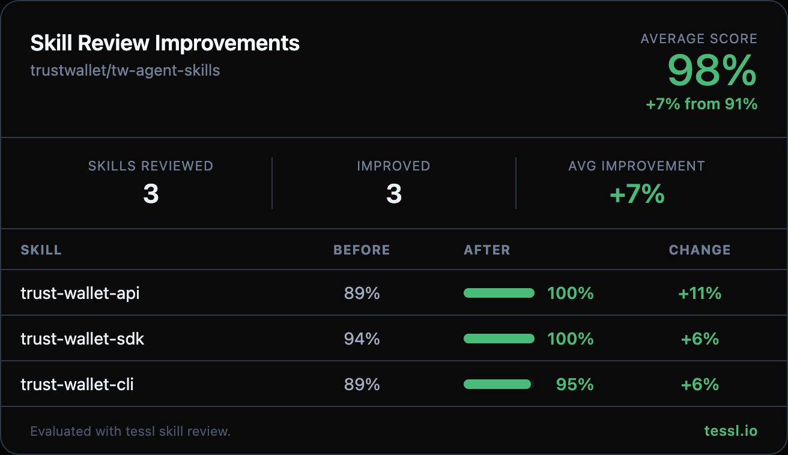

Hey @vcoolish-tw 👋

I ran your skills through `tessl skill review` at work and found some targeted improvements. Here's the full before/after:

| Skill | Before | After | Change |
|-------|--------|-------|--------|
| trust-wallet-sdk | 94% | 100% | +6% |
| trust-wallet-cli | 89% | 95% | +6% |
| trust-wallet-api | 89% | 100% | +11% |

Your skills were already well-structured — the descriptions all scored 100% out of the box. These changes focus on the content dimension (actionability and workflow clarity), which is where the evaluator flagged room for improvement.

Changes summary

**trust-wallet-sdk**
- Added a Quick Start section with an executable TypeScript snippet showing the core Wallet Core flow (mnemonic → HDWallet → PrivateKey → Address)
- Added a scope boundary note clarifying that Wallet Core handles keys/signing only, not networking

**trust-wallet-cli**
- Added inline example commands to Quick Start (`twak auth status`, `twak wallet balance`, `twak send`)
- Added a Safety section with guidance for destructive operations (send, swap, approve) — important for a crypto wallet CLI

**trust-wallet-api**
- Added a complete executable Python example with HMAC-SHA256 signing to Quick Start
- Added asset ID format reference (`c{coin}`, `c{coin}_t{contract}`)
- Added error handling guidance (401/429/200 status codes)

Honest disclosure — I work at @tesslio where we build tooling around skills like these. Not a pitch - just saw room for improvement and wanted to contribute.

Want to self-improve your skills? Just point your agent (Claude Code, Codex, etc.) at [this Tessl guide](https://docs.tessl.io/evaluate/optimize-a-skill-using-best-practices) and ask it to optimize your skill. Ping me - [@yogesh-tessl](https://github.com/yogesh-tessl) - if you hit any snags.

Thanks in advance 🙏
